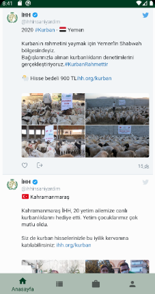
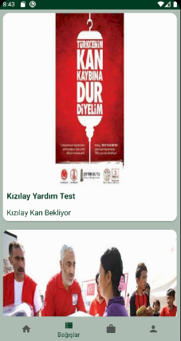
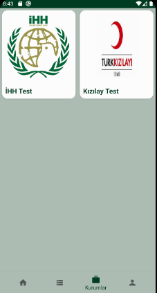
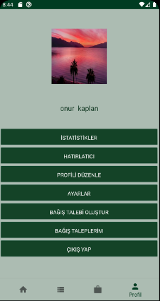

= Aid App

*Still under development.*

Technologies used in the project are java and firebase.

It is a mobile application to create, access, and participate in relief campaigns individually or institutionally.

=== Home Page
Users can access to tweets of charities.

=== Donations
Users can donate, helped by automatic sms or cash.

=== Institutions
Users can access the information of official institutions and donations opened by those institutions.

=== Profile
Users can edit their profile information, create and edit donations.

